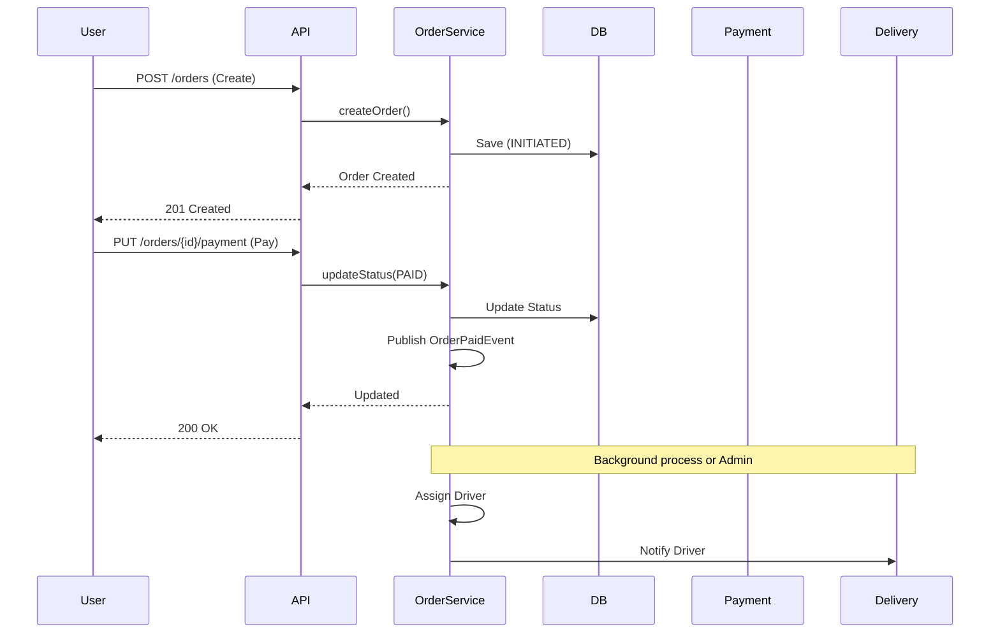

# Order Management System (OMS)

A Modular Monolith application for managing orders and delivery partners, built with Spring Boot 3.4+ and Java 17/21.

## Table of Contents
- [Features](#features)
- [Tech Stack](#tech-stack)
- [Architecture](#architecture)
- [Prerequisites](#prerequisites)
- [Getting Started](#getting-started)
- [API Documentation](#api-documentation)
  - [Orders](#orders-api)
  - [Delivery Partners](#delivery-partners-api)
- [Configuration](#configuration)

## Features

-   **Order Creation**: Create new orders with details like customer information, order items, and delivery address.
-   **Order Status Management**: Full state machine implementation: `INITIATED` → `PENDING_PAYMENT` → `PAID` → `CONFIRMED` → `PREPARING` → `READY_FOR_PICKUP` → `PICKED_UP` → `IN_TRANSIT` → `DELIVERED`.
-   **Idempotency**: Safe retry mechanisms using `Idempotency-Key` header.
-   **Delivery Partner Management**: Register and manage delivery partners, including their availability status.
-   **Order Assignment**: Assign orders to available delivery partners.
-   **Domain-Driven Design**: Clear separation between domain models, entities, DTOs, and services.
-   **RESTful API**: Exposes a comprehensive set of REST endpoints.
-   **Production Ready**: Docker support, Database Migrations (Flyway), and Environment Profiles.

## Tech Stack

-   **Java**: Version 17
-   **Spring Boot**: Version 3.4.0
-   **Maven**: Build automation tool
-   **Spring Data JPA**: For data persistence.
-   **Flyway**: Database migrations.
-   **PostgreSQL**: Production database.
-   **H2 Database**: Dev database.
-   **Lombok**: Boilerplate reduction.

## Architecture

```mermaid
graph TD
    Client[Client App] -->|REST / JSON| Gateway[API Gateway / Load Balancer]
    Gateway -->|HTTP| App[Order Management Service]
    
    subgraph "Order Management Service"
        API[API Layer (Controllers)]
        Domain[Domain Layer (Services, Models)]
        Infra[Infrastructure Layer (Repositories, Events)]
        
        API --> Domain
        Domain --> Infra
    end
    
    Infra -->|JPA| DB[(PostgreSQL)]
    Infra -->|Events| Broker{Event Broker (Future)}
```

## Idempotency

The API supports idempotency for safe retries.
- **Header**: `Idempotency-Key: <unique-uuid>`
- **Behavior**: If a request is repeated with the same key, the server returns the cached response without re-processing.

## Docker Build & Run

### 1. Build the Docker Image
```bash
docker build -t ordermanagement .
```

### 2. Run with Docker Compose
To run the full stack (App + Postgres + Redis + MailHog):
*First, update docker-compose.yml to include the app service or run separately.*

**Run App Standalone (connecting to local DB or H2):**
```bash
docker run -p 8080:8080 -e SPRING_PROFILES_ACTIVE=dev ordermanagement
```

## Prerequisites

- Java 17
- Docker (optional)
- Maven

## Getting Started

1. **Start Infrastructure**
   ```bash
   docker compose up -d
   ```

2. **Run the Application**
   ```bash
   ./mvnw spring-boot:run
   ```

3. **Access the Application**
   - API Base URL: `http://localhost:8080`
   - Swagger UI: `http://localhost:8080/swagger-ui.html`

## API Documentation

### Order Lifecycle Sequence



### Orders API

**Base URL**: `/api/v1/orders`

#### 1. Create a New Order
*   **Method**: `POST /api/v1/orders`
*   **Headers**: `Idempotency-Key: <uuid>`
*   **Body**:
    ```json
    {
      "customerId": "cust_123",
      "customerName": "John Doe",
      "restaurantId": "rest_456",
      "restaurantName": "Burger King",
      "orderType": "FOOD",
      "deliveryAddress": { ... },
      "restaurantAddress": { ... },
      "items": [ ... ]
    }
    ```
*   **Response**: `201 Created` with `OrderResponse`

#### 2. Get Order by ID
*   **Method**: `GET /api/v1/orders/{id}`
*   **Response**: `200 OK`

#### 3. Search Orders
*   **Method**: `GET /api/v1/orders`
*   **Query Params**:
    *   `customerId` (optional)
    *   `restaurantId` (optional)
    *   `status` (optional)
    *   `city` (optional)
    *   `page` (default 0)
    *   `size` (default 20)

#### 4. Update Order Status
*   **Method**: `PUT /api/v1/orders/{id}/status`
*   **Body**:
    ```json
    {
      "status": "PREPARING"
    }
    ```

#### 5. Cancel Order
*   **Method**: `DELETE /api/v1/orders/{id}?reason=MindChanged`

---

### Delivery Partners API

**Base URL**: `/api/v1/delivery-partners`

#### 1. Create Delivery Partner
*   **Method**: `POST /api/v1/delivery-partners`
*   **Body**:
    ```json
    {
      "name": "Jane Smith",
      "phoneNumber": "+1234567890",
      "email": "jane@example.com",
      "currentLocation": {
        "city": "New York",
        "country": "USA"
      },
      "vehicleType": "BIKE",
      "vehicleNumber": "NY-1234"
    }
    ```

#### 2. Get All Partners
*   **Method**: `GET /api/v1/delivery-partners`

#### 3. Get Partner by ID
*   **Method**: `GET /api/v1/delivery-partners/{id}`

#### 4. Find Available Partners
*   **Method**: `GET /api/v1/delivery-partners/available/{city}`
*   **Query Params**: `strategy` (default `CITY_BASED`)

#### 5. Assign Partner to Order
*   **Method**: `PUT /api/v1/delivery-partners/{partnerId}/assign/{orderId}`

#### 6. Update Partner Status
*   **Method**: `PUT /api/v1/delivery-partners/{id}/status/{status}`
*   **Example**: `/api/v1/delivery-partners/1/status/BUSY`

#### 7. Get Partners by Status
*   **Method**: `GET /api/v1/delivery-partners/status/{status}`

## Configuration

The application uses `application.yml` for configuration.
- **Database**: Postgres (Prod) or H2 (Dev fallback).
- **Redis**: Disabled by default in dev if not found.