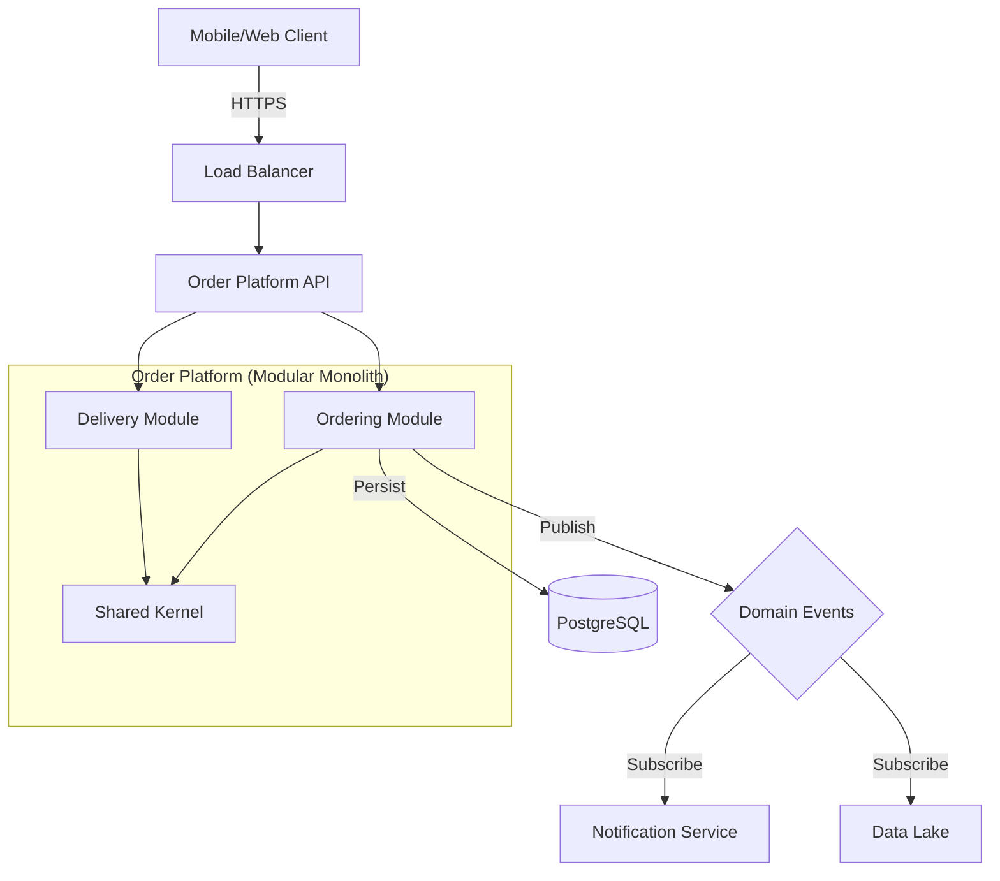

# Order & Logistics Platform (Swiggy-Class)

A production-grade, modular monolith platform for managing high-scale consumer orders and logistics. Designed with strict state governance, financial safety, and event-driven architecture principles.

## 🚀 Mission
To provide a reliable, retry-safe, and audit-compliant backend for order lifecycles, from initiation to delivery (or compensation), capable of handling real-world distributed system failures.

## 🌟 Key Features

### 🛡️ Core Reliability
- **Strict State Machine**: Orders follow a directed acyclic graph (DAG) of states. No illegal transitions.
- **Idempotency**: All mutating APIs (`POST`, `PUT`, `DELETE`) require an `Idempotency-Key` header to ensure exactly-once processing.
- **Transactional Outbox Pattern**: Guaranteed "At-Least-Once" event delivery to Kafka. Resolves the Dual-Write problem by persisting events in the same transaction as order changes.
- **Financial Safety**: Refund workflows are transactional and strictly gated.

### 🔄 Order Lifecycle
The system enforces the following lifecycle:
`INITIATED` → `PENDING_PAYMENT` → `PAID` → `CONFIRMED` → `PREPARING` → `READY_FOR_PICKUP` → `PICKED_UP` → `IN_TRANSIT` → `DELIVERED`

*Exceptions:*
- `CANCELLED` (from allowed states)
- `FAILED` (system errors)
- `REFUNDED` (compensation terminal state)

### 📡 Event-Driven Architecture
Every state transition emits a domain event. We use the **Transactional Outbox Pattern** to ensure high reliability:
1. **Domain Change**: Order saved + Event saved to `outbox_events` (Atomic DB transaction).
2. **Message Relay**: `OutboxMessageRelay` polls pending events and publishes to Kafka.
3. **Retry Logic**: Automatic retries (max 5) with failure tracking.
- `OrderInitiatedEvent`
- `OrderPaidEvent`
- `OrderConfirmedEvent`
- `OrderPickedUpEvent`
- ... and more.

### 🔭 Observability
- **Health Checks**: `/actuator/health` (Readiness/Liveness)
- **Metrics**: `/actuator/metrics` & `/actuator/prometheus`
- **Structured Logging**: Context-aware logs with trace IDs and order IDs.

## 🛠️ Tech Stack

- **Language**: Java 17
- **Framework**: Spring Boot 3.4.0
- **Database**: PostgreSQL (Production), H2 (Dev)
- **Migration**: Flyway
- **Docs**: OpenAPI 3 (Swagger)
- **Build**: Maven

## 🏗️ Architecture



## 🚀 Getting Started

### Prerequisites
- Java 17+
- Docker & Docker Compose
- Maven

### Quick Start
1. **Start Infrastructure** (Postgres, Redis, MailHog)
   ```bash
   docker compose up -d
   ```
2. **Run Application**
   ```bash
   ./mvnw spring-boot:run
   ```
3. **Explore API**
   - Swagger UI: `http://localhost:8080/swagger-ui.html`
   - Actuator: `http://localhost:8080/actuator`

## 📖 API Documentation

### Idempotency
- Header: Idempotency-Key (required for POST/PUT/DELETE that mutate state)
- Scope: per endpoint and authenticated principal
- Format: UUID v4 recommended; max 128 chars
- Behavior:
  - First request processes; response cached with status and body
  - Subsequent identical key within retention returns cached response
- Retention: configurable TTL (default 24h); scheduled cleanup job
- Error cases:
  - Missing header on mutating endpoints: 400 ERR_IDEMPOTENCY_REQUIRED
  - Key reuse with conflicting payload: 409 ERR_IDEMPOTENCY_MISMATCH
- Response headers:
  - Idempotency-Key: echoed
  - Idempotency-Status: new|replayed
- Security: keys are opaque, stored hashed; never log raw keys


### 1. Order Management (`/api/v1/orders`)

| Method | Endpoint | Description | Idempotency Required |
| :--- | :--- | :--- | :---: |
| `POST` | `/` | Create a new order | ✅ |
| `GET` | `/{id}` | Get order details | ❌ |
| `PUT` | `/{id}/status` | Update status (requires `targetState`, `reason`) | ✅ |
| `PUT` | `/{id}/assign` | Assign to partner (Only in `READY_FOR_PICKUP`) | ✅ |
| `POST` | `/{id}/refund` | Process refund (Only `FAILED`/`CANCELLED`) | ✅ |
| `DELETE` | `/{id}` | Cancel order | ✅ |

### 2. Delivery Logistics (`/api/v1/delivery-partners`)
*Manage fleet, availability, and location.*

## 🧪 Testing
Run integration tests:
```bash
./mvnw test
```

## 🔮 Future Roadmap
- [x] **Phase 3**: Kafka Integration for async event processing.
- [ ] **Phase 4**: Redis caching for read-heavy endpoints.
- [ ] **Phase 5**: Kubernetes Helm charts.

---
*Maintained by Platform Engineering Team*
